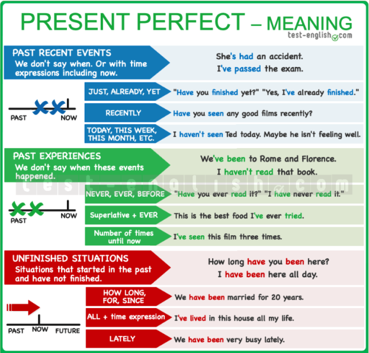

# A2

## [will vs be going to – future](https://test-english.com/grammar-points/a2/will-vs-be-going-to/)

 (1) (1).png>)

### Predictions

&#x20;\
Use **will** to talk about something that you think will happen.

* _I think he’**ll win** the election._
* _He **will be** a good doctor._

Use **be going to** to talk about something that you see is going to happen (there is present evidence).

* _Don’t drive like a crazy man. We’**re going to have** an accident!_
* _The doctor said I’**m going to have** a girl._

Sometimes there’s little difference between **will** and **be going to** for predictions. Compare:

* _The conference starts in 10 minutes. We **are going to be** late._ (=I can **see** that we cannot be at the conference in 10 minutes)
* _We need to hurry up. We’ll be late for the conference._ (=I **think** we will be late)

&#x20;

### Decisions

&#x20;\
Use **will** for decisions that you take at the moment of speaking (instant decisions).

* _‘Oh, we don’t have sugar.’ ‘Don’t worry, I’**ll buy** some.’_

Use **be going to** for decisions that you have already taken at the moment of speaking (intentions or plans).

* _‘Why are you undressing?’ ‘Because I’**m going to go** for a swim.’_

Compare these two sentences:

* _‘Sarah said she needs to talk to you.’ ‘Oh, I didn’t know. I’**ll call her** in a minute.’_ (=I took the decision **while** having this conversation.)
* _‘Sarah said she needs to talk to you.’ ‘Yes, I know. I’**m going to call her** in a minute._‘ (=I took the decision **before** having this conversation.)

## [Asking questions in English – Question forms](https://test-english.com/grammar-points/a2/asking-questions-in-english/)

.png>)

**Questions in general**

&#x20;\
If we want to ask a question in English, the order is **QWASM**: **Question word, Auxiliary verb, Subject, Main verb**. In **Yes-No questions** (questions where the answer is **yes** or **no**), there is no Question Word.\
&#x20;

**Questions with be as the main verb**

&#x20;\
When **be** is the main verb, it is used as the **Auxiliary** in the question, and then we don’t have a **Main verb** after the Subject.\
&#x20;

**Auxiliary verbs**

&#x20;\
In the position of **Auxiliary**, we can use **be**, **do**, **have** or any modal verb: **can, could, will, would, should**, etc.

**Have** is only an auxiliary verb in the form **have got** and in the **present perfect**.

* _**Have** you **got** any brothers or sisters?_
* _What **have** you **cooked** for lunch?_

For other uses of **have**, we need an auxiliary verb (**do**, **did**) for questions.

* _What time **did** you have dinner yesterday?_ (NOT ~~had you dinner~~)
* _**Do** you **have** to do it now?_ (NOT ~~Have you to do it~~)

**Have got** only has a present form. It does not have a past form.

* _**Did** you **have** many toys when you were a child?_ (NOT ~~Had you got many toys when you were a child?~~)

### &#x20;Question words

 (1).png>)

**how much**

&#x20;\
We can use **how much** to ask about the price of something.

* How much is the jacket?&#x20;

**how + adjective**

&#x20;\
We can use **how + adjective** (any adjective) as a question word.

* _**How tall** are you?_
* _**How fast** is your car?_

&#x20;

**which vs what**

&#x20;\
We can use **which + noun**, and we can also use **what + noun**. We use **which** when there are a small number of possible answers. Look at the difference:

* _**Which** car do you like, the red or the blue?_ (there is a small number of possible answers)
* _‘**What** car have you got?’ ‘A Mercedes.’_ (many possible answers)

## [Subject questions, questions with preposition](https://test-english.com/grammar-points/a2/subject-questions-questions-preposition/)

### Subject questions and object questions

&#x20;\
We use subject questions when we are asking about who, what, etc. did the action. We do not use an auxiliary verb after the question word if the question word (**who**, **what**, **etc**.) is the subject of the sentence.

* _**Who** won the match?_ (NOT ~~Who did win~~ … )
* _**What** happened last night?_ (NOT ~~What did happen~~ … )
* _**How many people** went to the party?_ (NOT ~~How many people did go~~ …)

When we are asking about the object (after the verb) we use the normal order of the English question: **auxiliary verb + subject**. These types of questions are called object questions.\
&#x20;

**Object question vs subject question**

&#x20;

| Jack called <mark style="color:orange;">Teresa</mark>. (Teresa = object) | <mark style="color:orange;">Jack</mark> called Teresa. (Jack = subject) |
| ------------------------------------------------------------------------ | ----------------------------------------------------------------------- |
| <mark style="color:orange;">Who</mark> did Jack call? (Who = object)     | <mark style="color:orange;">Who</mark> called Teresa? (Who = subject)   |

&#x20;

### Questions with preposition

&#x20;\
In informal or spoken English, when a question word needs a preposition, the preposition goes at the end of the question (after the verb or after verb + object if there is an object). We don’t use the preposition at the beginning.

* _I played tennis **with John**._ ⇒ _ **Who** did you play tennis **with**?_&#x20;
* _I work **for a multinational company**_ ⇒  _  **What** company do you work **for**?_
* _We usually talk **about sports**._ ⇒ _**What** do you usually talk **about**?_&#x20;

## [Past continuous and past simple](https://test-english.com/grammar-points/a2/past-continuous-past-simple/)

### The past continuous form

.png>)

### We use the past continuous

&#x20;

**Actions in progress**

&#x20;\
We use the past continuous to talk about **actions** that were **in progress** (not finished) at a specific moment **in the past**.

* _‘What **were** you **doing** at 9?’ ‘I **was studying**.’_
* _When I saw them yesterday, they **were arguing**._

The specific moment in the past can be described by a **time expression**  (at 9 a.m., at midday, at lunchtime, all morning, all day, etc.):

* _They were swimming **at 7 in the morning.**._
* _**At midday** they were still working._

Or by a **simple past sentence**:

* _They were swimming **when I saw them**._
* _**When she arrived**, they were still working._

&#x20;

**Describing a scene**

&#x20;\
We often use the past continuous at the beginning of a story to describe the situation.

* _It **was getting** dark, and I **was walking** fast. Suddenly …_

&#x20;

### Past simple vs past continuous

&#x20;\
We use the [past simple](https://test-english.com/grammar-points/a2/past-simple-form-use/) for **completed actions in the past**, and we use the past continuous for **actions in progress** (not finished) in the past.

* _We **ate out** yesterday._ (the action is finished)
* _We **were eating** at 9._ (the action was not finished)

The past continuous describes a longer action or situation and the past simple describes a shorter action or event.

* _When I **met** Susan she **was having** a drink at a terrace with a friend._&#x20;
* _We **didn’t go out** because it **was raining**._&#x20;

The short action in past simple often interrupts the longer action in past continuous.

* _He **was playing** football when he **broke** his arm._&#x20;
* _When I **went** to bed, it **was raining**._&#x20;

We use the past simple for completed actions that happened one after the other. Compare:

* _When he **arrived**, she **was having** a shower._
* (The action of having a shower started **before** he arrived)
* _When he **arrived**, she **had** a shower._
* (The action of having a shower started **after** he arrived)

## [Expressing purpose with ‘to’ and ‘for’](https://test-english.com/grammar-points/a2/purpose-to-for/)&#x20;

We can use **to** + infinitive and **for** + noun to say what is the purpose of an action, or the reason why we do something.&#x20;

### **to** + infinitive&#x20;

* _I went to the grocery store <mark style="color:green;">**to buy**</mark> some vegetables._&#x20;
* _I studied hard <mark style="color:green;">**to pass**</mark> the exam._&#x20;

### **for** + noun&#x20;

* _Let’s go to the pub <mark style="color:green;">**for**</mark> <mark style="color:green;"></mark><mark style="color:green;"></mark> a drink._&#x20;
* _We climbed to the top <mark style="color:green;"><mark style="color:orange;">**for**<mark style="color:orange;"></mark> <mark style="color:green;"><mark style="color:orange;"> </mark><mark style="color:green;"><mark style="color:orange;"><mark style="color:orange;"></mark> the views._&#x20;

**Compare **_**to**_** vs **_**for**_**:**&#x20;

* _I went to the shop <mark style="color:green;">**to buy**</mark> some milk._&#x20;
* _I went to the shop <mark style="color:green;">**for**</mark> <mark style="color:green;"></mark><mark style="color:green;"></mark> some milk._&#x20;

### **for** + **-ing**

We don’t use **for** + **-ing** to say what is the purpose of our actions, why we do something.

* _I work hard _~~_for improving_~~_ my English._
* _<mark style="color:green;">I work hard to improve my English.</mark>_
* _Turn the TV on _~~_for watching_~~_ the news._
* _<mark style="color:green;">Turn the TV on to watch the news.</mark>_

We use **for + ing** to talk about the purpose or function of a thing, what an object is used for.

* _This machine is used <mark style="color:green;">**for cleaning**</mark> <mark style="color:green;"></mark><mark style="color:green;"></mark> cars._
* _This is a special camera <mark style="color:green;">**for photographing**</mark> small objects._ &#x20;

## [Present continuous for future arrangements](https://test-english.com/grammar-points/a2/present-continuous-future-arrangements/)

We often use the present continuous to talk about the future, especially about future plans when we have **decided a time and a place** with other people. We normally use a future time expression, e.g. **tomorrow**, **next week, at 7,** **etc**.

* _I’**m meeting** Sally at 7._ (=I have talked to her and we have arranged to meet.)
* _I’**m flying** to New York tomorrow morning._ (=I have the ticket.)
* _We’**re getting married** next July._ (=We have decided it and we have probably already made reservations for the restaurant, etc.)

The present continuous for future arrangements is very common with verbs of travelling, and when we are meeting people.

* _I’**m leaving** very early tomorrow. I’**m taking** the 7.30 train._&#x20;
* _I’**m playing** golf with Jack next Saturday. Would you like to come?_
* _I’**m seeing** the dentist after class._&#x20;

### Present continuous vs **be going to**

&#x20;\
We can normally use the present continuous or **be going to** to talk about future plans.

* _I’**m leaving** very early tomorrow._
* _I’**m going to leave** very early tomorrow._

But we prefer using the present continuous when we have made **arrangements** (i.e. decided a place and time with somebody else). When use **be going to**, we put the emphasis on our **intention** to do something.

* _I’**m going to study** for the exams tomorrow._ (=it’s my intention)
* _I’**m leaving** at 8 tomorrow._ (=it’s an arrangement)
* _‘Your car is dirty.’ ‘I know. I’**m going to wash** it tomorrow.’_ (=it’s my intention, but I haven’t arranged to do it)&#x20;

### **will** for decisions

&#x20;\
Use **will** for decisions that you take at the moment of speaking (instant decisions).

* _‘Oh, we don’t have sugar.’ ‘Don’t worry, I’**ll buy** some.’_&#x20;

### **be going to** or **will** for predictions

&#x20;\
We use **be going to** or **will** (NOT the present continuous) to make predictions about the future. (⇒ See Grammar points » A2 Grammar » [Will vs be going to – Future](https://test-english.com/grammar-points/a2/will-vs-be-going-to/))

* _I think he’**ll win** the election._
* _The doctor said I’**m going to have** a girl._

## [Present perfect – form and use](https://test-english.com/grammar-points/a2/present-perfect/)

### Present perfect form

&#x20;We form the present perfect tense with the verb **have** and the past participle of the verb. The past participle is the same as the past simple (**-ed**) for regular verbs. For irregular verbs, it’s the form in the 3rd column.

.png>)

### Present perfect use

&#x20;We normally use the present perfect to talk about past events that have a connection with the present; for example, news or past experiences. We can also use the present perfect to talk about situations that started in the past, but which are still true in the present. Check the grammar chart below:

#### Recent events and news

&#x20;\
We use the present perfect to talk about recent events or news. We don’t say when these events happened.

* _I’**ve passed** the test!_
* _She’**s broken** her arm._
* _The president **has travelled** to Cuba._&#x20;

__

&#x20;**⇒ **<mark style="color:orange;">**Just, yet, already**</mark>

&#x20;\
We often use the present perfect with the words **just, yet, already**.

We use **just** in (+) sentences to say that something happened very recently (like minutes ago).

* _I’**ve just seen** Peter in the street._&#x20;
* _He looks happy because he’**s just got married**._&#x20;

We use **yet** in (-) and (?) sentences. We put it at the end of the sentence.

* _**Have** you **washed** the dishes **yet**?_
* _I **haven’t**  **called** him **yet**._
* _She **hasn’t arrived yet**._&#x20;

We use **already** in **** (+) sentences to say that something happened before now (usually, earlier than we expected).

* _I **have already finished**._
* _We **have already arrived**._&#x20;

&#x20;Life experiences

&#x20;We often use the present perfect to talk about past experiences in our lives. We don’t say when these experiences happened.

* _I’**ve run** the Boston Marathon twice._
* _She’**s** never **been** on a cruise._&#x20;
* _I’**ve been** here before._&#x20;

&#x20;

**⇒ **<mark style="color:orange;">**Never, ever, before**</mark>

&#x20;\
When we ask about someone’s life experiences we often use the word **ever**.

* _**Have** you **ever**  **read** this book?_
* _**Have** you **ever**  **been** to India?_

When we talk about life experiences, we often use the words **never** or **before**.

* _She **has never been** late._&#x20;
* _I think I **have seen** this film **before**._&#x20;

### &#x20;Unfinished actions

&#x20;

**⇒ **<mark style="color:orange;">**How long, for, since**</mark>

&#x20;\
We use the present perfect with the words **how long**, **for**, **since** to talk about actions or situations that started in the past and still continue or are still true now.

* _I’**ve lived** in Oslo **since** I was born._ (=I was born in Oslo and I still live in Oslo)
* _They **have been** married **for** 25 years._ (=They got married 25 years ago and they are still married)

We use **how long** in questions to ask about the duration of an action or situation.

* _**How long**  **has** she **been** a teacher?_
* _**How long**  **has** she **had** her car?_

We use **for** + a period of time, e.g. **for** two weeks, **for** ten years, **for** ten days, **for** a few hours, etc.

* _We’**ve been** here **for** a few hours._&#x20;
* _They’**ve been** married **for** 10 years._&#x20;

We use **since** + a moment in the past (the beginning of a period of time), e.g. **since** I was born, **since** 10 o’clock, **since** last Wednesday, etc.

* _We’**ve been** here **since** 4 o’clock._&#x20;
* _They’**ve been** married **since** 2010._&#x20;

&#x20;

#### Be careful with these common mistakes!

&#x20;\
We use present perfect, and not present simple for actions or situations that started in the past and are still true now.

* _We’**ve been** friends since first grade_. (NOT ~~_We are friends since first grad_e~~.)

We don’t use the word **ago** with the present perfect.

* _They’**ve been** married **for** 10 years._ (NOT ~~_They are married since 10 years ago_~~_._)
