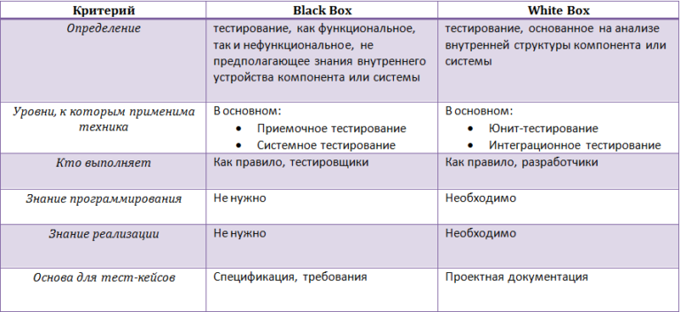

# Тестирование

## Unit testing

**Модульное тестирование**, иногда **блочное тестирование** или **юнит-тестирование** \(англ. unit testing\) — процесс в программировании, позволяющий проверить на корректность отдельные модули исходного кода программы, наборы из одного или более программных модулей вместе с соответствующими управляющими данными, процедурами использования и обработки.

Идея состоит в том, чтобы писать тесты для каждой нетривиальной функции или метода. Это позволяет достаточно быстро проверить, не привело ли очередное изменение кода к [регрессии](testing.md#regression-testing), то есть к появлению ошибок в уже оттестированных местах программы, а также облегчает обнаружение и устранение таких ошибок.

## Integration Testing

  **Интеграционное тестирование** — одна из фаз тестирования программного обеспечения, при которой отдельные программные модули объединяются и тестируются в группе. Обычно интеграционное тестирование проводится после [модульного тестирования](testing.md#unit-testing) и предшествует [системному тестированию](testing.md#system-testing).

  Интеграционное тестирование в качестве входных данных использует модули, над которыми было проведено модульное тестирование, группирует их в более крупные множества, выполняет тесты, определённые в [плане тестирования](../testovaya-dokumentaciya/test-plan.md) для этих множеств, и представляет их в качестве выходных данных и входных для последующего системного тестирования.

  Целью интеграционного тестирования является проверка соответствия проектируемых единиц функциональным, приёмным и требованиям надежности. Тестирование этих проектируемых единиц — объединения, множества или группы модулей — выполняется через их интерфейс, с использованием тестирования «[чёрного ящика](testing.md#black-box-testing)».  
  
 В рамках интеграционного тестирования также может проводиться [регрессионное тестирование ](testing.md#regression-testing)с целью проверки сделанных в приложении или окружающей среде изменений и работоспособности унаследованной функциональности.

### **Уровни интеграционного тестирования:**

* **Компонентный интеграционный уровень** \(Component Integration testing\)

  > Проверяется взаимодействие между компонентами системы после проведения компонентного тестирования.

* **Системный интеграционный уровень** \(System Integration Testing\)

  > Проверяется взаимодействие между разными системами после проведения системного тестирования.

### **Подходы к интеграционному тестированию:**

* **Снизу вверх** \(Bottom Up Integration\)

  > Все низкоуровневые модули, процедуры или функции собираются воедино и затем тестируются. После чего собирается следующий уровень модулей для проведения интеграционного тестирования. Данный подход считается полезным, если все или практически все модули, разрабатываемого уровня, готовы. Также данный подход помогает определить по результатам тестирования уровень готовности приложения \(см. также [Integration testing - Bottom Up](http://en.wikipedia.org/wiki/Integration_testing#Bottom_Up)\)

* **Сверху вниз** \(Top Down Integration\)

  > Вначале тестируются все высокоуровневые модули, и постепенно один за другим добавляются низкоуровневые. Все модули более низкого уровня симулируются заглушками с аналогичной функциональностью, затем по мере готовности они заменяются реальными активными компонентами. Таким образом мы проводим тестирование сверху вниз. \(см. также [Top Down Integration](http://en.wikipedia.org/wiki/Integration_testing#Top-down_and_Bottom-up)\)

* **Большой взрыв** \("Big Bang" Integration\)

  > Все или практически все разработанные модули собираются вместе в виде законченной системы или ее основной части, и затем проводится интеграционное тестирование. Такой подход очень хорош для сохранения времени. Однако если тест кейсы и их результаты записаны не верно, то сам процесс интеграции сильно осложнится, что станет преградой для команды тестирования при достижении основной цели интеграционного тестирования \(см. также [Integration testing - Big Bang](http://en.wikipedia.org/wiki/Integration_testing#Big_Bang)\)

### **Преимущества интеграционного тестирования**:

Интеграционное тестирование позволяет имитировать действия пользователей и быстро получать подтверждение, что программный продукт успешно взаимодействует с другими системами. Такой подход гарантирует сразу несколько преимуществ:

1. Предотвращение появления критичных ошибок в опытно-промышленной эксплуатации
2. Снижение влияния человеческого фактора
3. Экономия затрат на исправление дефектов

### Основные этапы **интеграционного тестирования**:

* Разработка [тест-плана](../testovaya-dokumentaciya/test-plan.md) – руководства к действию для тестировщиков;
* Формирование тестовых данных и создание [тест-кейсов](../testovaya-dokumentaciya/test-cases.md);
* Реализация сценариев для запуска [тест-кейсов](../testovaya-dokumentaciya/test-cases.md);
* Выполнение [тест-кейсов](../testovaya-dokumentaciya/test-cases.md) и исправление ошибок;
* Повторение цикла тестирования до успешной интеграции.

## Functional testing

  **Функциональное тестирование** является одним из ключевых видов тестирования, задача которого – установить соответствие разработанного программного обеспечения \(ПО\) исходным функциональным требованиям заказчика. То есть проведение функционального тестирования позволяет проверить способность информационной системы в определенных условиях решать задачи, нужные пользователям.

  **Функциональные тесты** основываются на функциях, выполняемых системой, и могут проводиться на всех уровнях тестирования \([компонентном](testing.md#unit-testing), [интеграционном](testing.md#integration-testing), [системном](testing.md#system-testing), [приемочном](testing.md#acceptance-testing-smoke-testing)\). Как правило, эти функции описываются в требованиях, функциональных спецификациях или в виде случаев использования системы \(**use cases**\).

Тестирование функциональности может проводиться в двух аспектах:

* **требования**
* **бизнес-процессы**

  Тестирование в перспективе «**требования**» использует спецификацию функциональных требований к системе как основу для дизайна тестовых случаев \([**Test Cases**](../testovaya-dokumentaciya/test-cases.md)\). В этом случае необходимо сделать список того, что будет тестироваться, а что нет,  приоритизировать требования на основе рисков \(если это не сделано в документе с требованиями\), а на основе этого приоритизировать тестовые сценарии \([test cases](../testovaya-dokumentaciya/test-cases.md)\). Это позволит сфокусироваться и не упустить при тестировании наиболее важный функционал.

  Тестирование в перспективе «**бизнес-процессы**» использует знание этих самых бизнес-процессов, которые описывают сценарии ежедневного использования системы. В этой перспективе тестовые сценарии \(**test scripts**\), как правило, основываются на случаях использования системы \(use cases\).

### **Преимущества функционального тестирования**:

* Функциональное тестирование ПО полностью имитирует фактическое использование системы.
* Позволяет своевременно выявить системные ошибки ПО и, тем самым, избежать множества проблем при работе с ним в дальнейшем.
* Экономия за счет исправления ошибок на более раннем этапе жизненного цикла ПО.

### **Недостатки функционального тестирования**:

* возможность упущения логических ошибок в программном обеспечении;
* вероятность избыточного тестирования.

### Типы функционального тестирования

  В зависимости от степени доступа к коду системы можно выделить два типа функциональных испытаний:

* тестирование [**black box**](testing.md#black-box-testing) \(черный ящик\) – проведение функционального тестирования без доступа к коду системы,
* тестирование [**white box**](testing.md#white-box-testing) \(белый ящик\) – функциональное тестирование с доступом к коду системы.

Тестирование **black box** проводится без знания внутренних механизмов работы системы и опирается на внешние проявления ее работы. При этом тестировании проверяется поведение ПО при различных входных данных и внутреннем состоянии систем.

В случае тестирования **white box** создаются [тест-кейсы](../testovaya-dokumentaciya/test-cases.md), основанные преимущественно на коде системы ПО. Также существует расширенный тип black-box тестирования, включающего в себя изучение кода, – так называемый [grey box](testing.md#grey-box-testing) \(серый ящик\).

### Основные этапы функционального тестирования

  **Подготовка -** Проводится анализ исходных документов о системе: функциональные и бизнес-требования, техническое задание, паспорт проекта. Также происходят разработка и согласование плана тестирования, тест-кейсов, согласование проектных сроков, числа итераций, оценка возможных рисков. Задачи по этому этапу выполняются совместно с представителями заказчика.

  **Проведение -** Функциональное тестирование ведется вручную по подготовленным заранее тестовым сценариям с занесением всех найденных ошибок в багтрекинговую систему.

  **Отчет -** Происходит разработка и согласование отчетов о проведенном тестировании со списком обнаруженных отклонений и рекомендациями по улучшению системы. Если необходимо, проводится обучение пользователей.

## System Testing

Системное тестирование предназначено для тестирования готового ПО в том состоянии, в котором оно будет внедряться в опытно-промышленную эксплуатацию.

Системное тестирование позволяет обнаружить такие дефекты как выявление отсутствующего функционала в системе, некорректная работа функций системы, возникновение ошибок при использовании специфических тестовых данных или их комбинации, ошибки взаимодействия с другими системами.

### Преимущества Системного тестирования

* Сокращение количества дефектов в опытно-промышленной эксплуатации;
* Возможность использования тестовых сценариев в качестве обучающих материалов для будущих пользователей системы;

### Основные задачи

* Определение подхода к составлению [тестовых сценариев](../testovaya-dokumentaciya/test-cases.md)
* Создание плана и методики испытаний
* Подготовка тестовых данных
* Проведение тестирования
* Выявление некорректного использования ресурсов 

### Этапы

1. Тестовый план
2. Разработка тестов
3. Подготовка тестовых данных
4. Тестовые прогоны – автоматизированные и обычные
5. Составление отчета
6. [Регрессионое тестирование](testing.md#regression-testing) после исправления ошибок

## Acceptance Testing \(Smoke testing\)

  Smoke testing \(встречаются названия intake test , build verification test, приемочное тестирование\) — тестирование, проводимое на начальном этапе \(например после нового билда\) и в первую очередь направленное на проверку готовности разработанного продукта к проведению более расширенного тестирования, определения общего состояния качества продукта.

  Это короткий цикл тестов, подтверждающий \(отрицающий\) факт того, что приложение стартует и выполняет свои основные функции. Данный тип тестирования позволяет на начальном этапе выявить основные быстро находимые критические дефекты. Исходя из того, что данные проверки практически всегда одинаковы и редко претерпевают изменениям, целесообразно будет их автоматизировать.

### Преимущества Smoke Test

* Выявление критичных ошибок в первые несколько часов \(минут\) после установки;
* Снижение рисков вывода некачественного продукта;
* Минимизация рисков при интеграции систем;
* Сокращение затрат на исправление дефектов;
* Ускорение проверки за счет автоматизации.

### Основные задачи Smoke Test

1. Выбор тестовых сценариев, таким образом, чтобы обеспечить тестовое покрытие наиболее приоритетных функций системы.
2. Определение количества SMOKE-тестов и времени их выполнения. Обычно для SMOKE-тестов выбирается не более 10 сценариев с временем их выполнения в несколько часов.
3. Написание сценариев тестирования, описание шагов воспроизведения и ожидаемых результатов их выполнения. По желанию клиента сценарии могут быть автоматизированы.
4. Выполнение SMOKE-тестов.

## Regression Testing

  **Регрессионное тестирование** — собирательное название для всех видов тестирования программного обеспечения, направленных на обнаружение ошибок в уже протестированных участках исходного кода. Такие ошибки — когда после внесения изменений в программу перестаёт работать то, что должно было продолжать работать, — называют регрессионными ошибками \(англ. regression bugs\).

  Регрессионное тестирование включает new bug-fix — проверка исправления вновь найденного дефекта, old bug-fix — проверка, что исправленный ранее и верифицированный дефект не воспроизводится в системе снова, а также side-effect — проверка того, что не нарушилась работоспособность работающей ранее функциональности, если её код мог быть затронут при исправлении некоторых дефектов в другой функциональности. Обычно используемые методы регрессионного тестирования включают повторные прогоны предыдущих тестов, а также проверки, не попали ли регрессионные ошибки в очередную версию в результате слияния кода.

### Преимущества регрессионного тестирования:

1. При регулярном проведении регрессионного тестирования - значительное сокращение количества дефектов в системе к моменту релиза
2. Исключение деградации качества системы при росте функциональности
3. Уменьшение вероятности критических ошибок в оп

### Основные этапы Regression Testing

* Верификационные тесты: включают тесты для проверки исправления ошибок и тесты для проверки сохранности базовой функциональности в каждой новой версии ПО;
* Регрессионные тесты: проверка новой версии программы с набором тестов, которые использовались при тестировании предыдущей версии и не выявили ошибок;
* Регресс на исправленных ошибках: проверка ранее выявленных и исправленных ошибок, это необходимо, чтобы избежать появления подобных ошибок после модификации кода. 

## Black-Box Testing

**Summary: Мы не знаем, как устроена тестируемая система.**

  Тестирование методом «черного ящика», также известное как тестирование, основанное на спецификации или тестирование поведения – техника тестирования, основанная на работе исключительно с внешними интерфейсами тестируемой системы.

Согласно ISTQB:

**тестирование черного ящика – это:**

– тестирование, как функциональное, так и нефункциональное, не предполагающее знания внутреннего устройства компонента или системы.

– тест-дизайн, основанный на технике черного ящика – процедура написания или выбора тест-кейсов на основе анализа функциональной или нефункциональной спецификации компонента или системы без знания ее внутреннего устройства.

  Почему именно «черный ящик»? Тестируемая программа для тестировщика – как черный непрозрачный ящик, содержания которого он не видит. Целью этой техники является поиск ошибок в таких категориях:

– неправильно реализованные или недостающие функции;

– ошибки интерфейса;

– ошибки в структурах данных или организации доступа к внешним базам данных;

– ошибки поведения или недостаточная производительности системы;

Таким образом, мы не имеем представления о структуре и внутреннем устройстве системы. Нужно концентрироваться на том, _что_ программа делает, а не на том, _как_ она это делает.

### Техники тест-дизайна, основанные на использования черного ящика, включают:

– классы эквивалентности;

– анализ граничных значений;

– таблицы решений;

– диаграммы изменения состояния;

– тестирование всех пар.

### **Преимущества:**

– тестирование производится с позиции конечного пользователя и может помочь обнаружить неточности и противоречия в спецификации;

– тестировщику нет необходимости знать языки программирования и углубляться в особенности реализации программы;

– тестирование может производиться специалистами, независимыми от отдела разработки, что помогает избежать предвзятого отношения;

– можно начинать писать тест-кейсы, как только готова спецификация.

### **Недостатки:**

– тестируется только очень ограниченное количество путей выполнения программы;

– без четкой спецификации \(а это скорее реальность на многих проектах\) достаточно трудно составить эффективные тест-кейсы;

– некоторые тесты могут оказаться избыточными, если они уже были проведены разработчиком на уровне модульного тестирования;

Противоположностью техники черного ящика является тестирование методом белого ящика, речь о котором пойдет ниже.

## White-Box Testing

**Summary: Нам известны все детали реализации тестируемой программы.**

  Тестирование методом белого ящика \(также: прозрачного, открытого, стеклянного ящика; основанное на коде или структурное тестирование\) – метод тестирования программного обеспечения, который предполагает, что внутренняя структура/устройство/реализация системы известны тестировщику. Мы выбираем входные значения, основываясь на знании кода, который будет их обрабатывать. Точно так же мы знаем, каким должен быть результат этой обработки. Знание всех особенностей тестируемой программы и ее реализации – обязательны для этой техники. Тестирование белого ящика – углубление во внутренне устройство системы, за пределы ее внешних интерфейсов.

Согласно ISTQB:

**тестирование белого ящика – это:**

– тестирование, основанное на анализе внутренней структуры компонента или системы.

– тест-дизайн, основанный на технике белого ящика – процедура написания или выбора тест-кейсов на основе анализа внутреннего устройства системы или компонента.

  Почему «белый ящик»? Тестируемая программа для тестировщика – прозрачный ящик, содержимое которого он прекрасно видит.

### **Преимущества:**

– тестирование может производиться на ранних этапах: нет необходимости ждать создания пользовательского интерфейса;

– можно провести более тщательное тестирование, с покрытием большого количества путей выполнения программы.

### **Недостатки:**

– для выполнения тестирования белого ящика необходимо большое количество специальных знаний

– при использовании автоматизации тестирования на этом уровне, поддержка тестовых скриптов может оказаться достаточно накладной, если программа часто изменяется.

### **Сравнение Black Box и White Box**

## **Grey Box Testing**

**Summary: Нам известны только некоторые особенности реализации тестируемой системы.**

  ****Тестирование методом серого ящика – метод тестирования программного обеспечения, который предполагает, комбинацию White Box и Black Box подходов. То есть, внутреннее устройство программы нам известно лишь частично. Предполагается, например, доступ к внутренней структуре и алгоритмам работы ПО для написания максимально эффективных тест-кейсов, но само тестирование проводится с помощью техники черного ящика, то есть, с позиции пользователя.

  Эту технику тестирования также называют методом полупрозрачного ящика: что-то мы видим, а что-то – нет.

## Test automatization

  Автоматизация тестирования приложений – это процесс проверки программного обеспечения, который включает проведение таких основных функций и шагов теста, как запуск, инициализация, выполнение, анализ и выдача результата, автоматически посредством специализированных инструментов.

  Автоматизированное тестирование – аналог ручного функционального тестирования , который выполняется программой-роботом, а не человеком.

### Ключевые преимущества

1. Повышение качества тестирования, поскольку при использовании средств автоматизации «человеческий фактор» не оказывает влияния на качество тестирования.
2. Возможность выполнения таких видов тестирования, которые либо не могут быть выполнены вручную, либо требуют значительных затрат \(дополнительное оборудование, персонал\).
3. Ускорение процесса тестирования без потери качества. Проведение того же объема работ ручным методом занимает больше времени. Использование средств автоматизации для тестирования позволяет запускать уже написанные скрипты без дальнейших доработок.
4. В ходе тестирования отчеты о результатах работы программных приложений рассылаются и сохраняются автоматически. 

###  Применение средств автоматизации для тестирования программного обеспечения актуально в следующих случаях:

* Запись в базу данных, логирование файлов, backend процессы, то есть места в системе, представляющие наибольшую труднодоступность.
* Достаточно часто используется функциональность, которая обладает высоким уровнем рисков на ошибки. При автоматизации критической функциональности посредством тестирования гарантированно обеспечивается быстрое нахождение ошибок.
* Автоматизированное тестирование эффективно для рутинных операций. Например, формы, в которых имеется большое количество полей для набора данных \(перебор данных\). Тестовый процесс позволяет автоматически выполнять заполнение полей, а также после сохранения осуществлять их проверку.
* Данный вид тестирования позволяет автоматизировать процесс заполнения полей некорректными данными, проводить проверку различной валидации.
* Длинные сценарии \(end-to-end\).
* Тестирование данных, для которых необходимы точные математические расчеты.
* Для автоматизации правильности поиска данных.

### Основные этапы автоматизации тестирования

**Подготовка -** Выбор бизнес-операций, подлежащих автоматизации тестирования, определение требований к Системе Автоматизированного Функционального Тестирования \(САФТ\), согласование проектных сроков, выбор инструмента автоматизации, оценка возможных рисков.

**Проведение -** Производится запуск автоматизированных тестов и проведение регрессионного автоматизированного тестирования, если необходимо.

 **Отчет -** Составляется итоговый документ с результатами тестирования, который содержит обнаруженные дефекты, отклонения от нормативов и предложения по улучшению системы. Создаются руководство пользователя и инструкции по настройке и сопровождению системы автоматизированного функционального тестирования.

## End-to-end Testing

  End-to-end тестирование это процесс тестирования приложения на всех уровнях – начиная с фронтенда и заканчивая бэкэндом, включая интерфейс и конечные точки. Такое тестирование использует пользовательские сценарии.

### Преимущества проведения Еnd-to-end тестирования:

* **Проверка бэкенда.**

  Выполнение Еnd-to-end тестирования помогает проверить внешний уровень приложения. Поскольку основное функционирование приложения зависит от базы данных, проверка этого уровня помогает определить, насколько хорошим является приложение и насколько точно он может выполнять требуемые функции.

* **Определение ошибок в неоднородной среде.**

  Благодаря end-to-end тестированию можно тестировать приложения, основанные на распределенных, гетерогенных, облачных и SOA-средах. Это также помогает выявлять проблемы в приложении, которые состоят из нескольких компонентов, поскольку оно включает полную проверку.

* **Валидация поведения приложений.**

  При тестировании и проверке поведения приложения по многоуровневой, сложной архитектуре или системным рабочим процессам важную роль играет end-to-end тестирование. Это помогает проверить общее функционирование и реакцию приложения на подключенные системы для определения соответствующих процессов и поведения.

* **Проводит повторные тесты в разных точках и процессах.**

  End-to-end тестирование дает возможность выполнения повторяемых тестов при различных процессах приложений, возникающих в разных точках.  
  Еnd-to-end тестирование также помогает проверять поток приложений и подсистем, увеличивая охват тестирования.  

